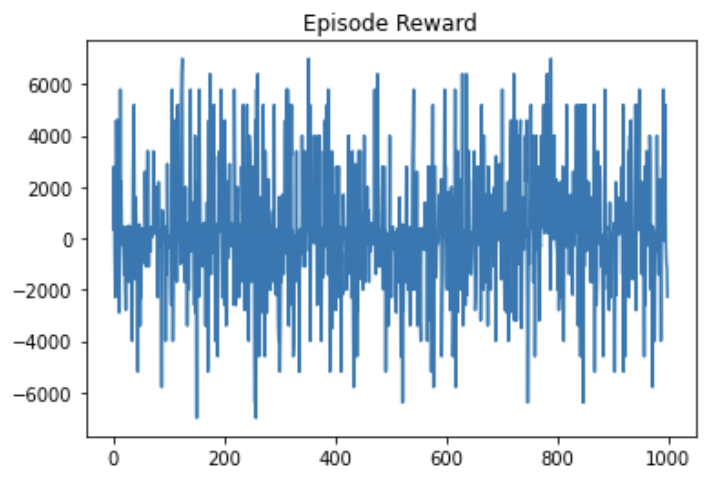
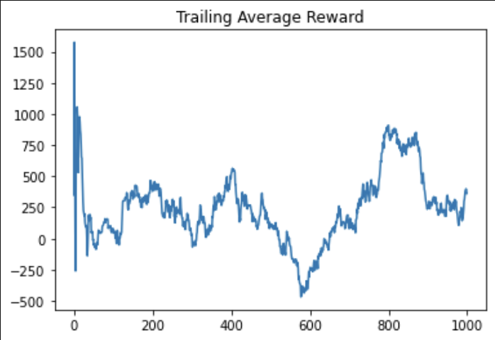
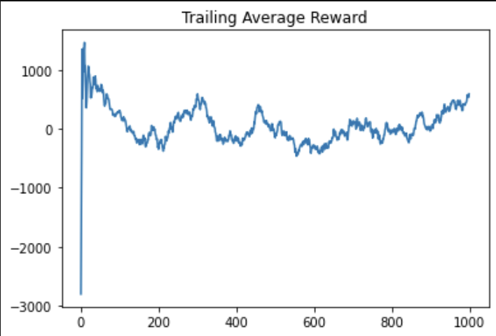
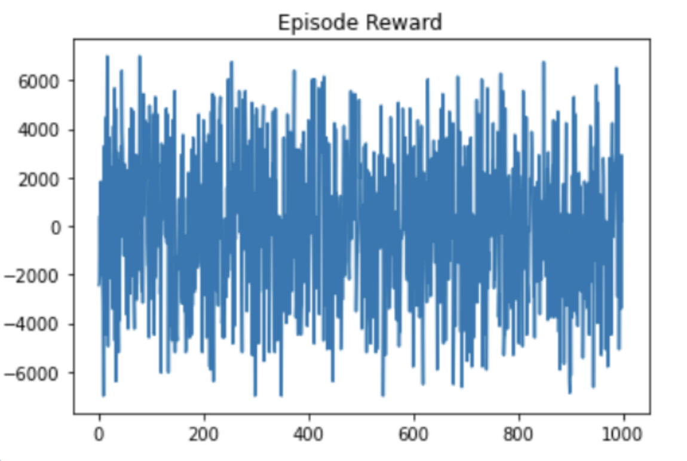
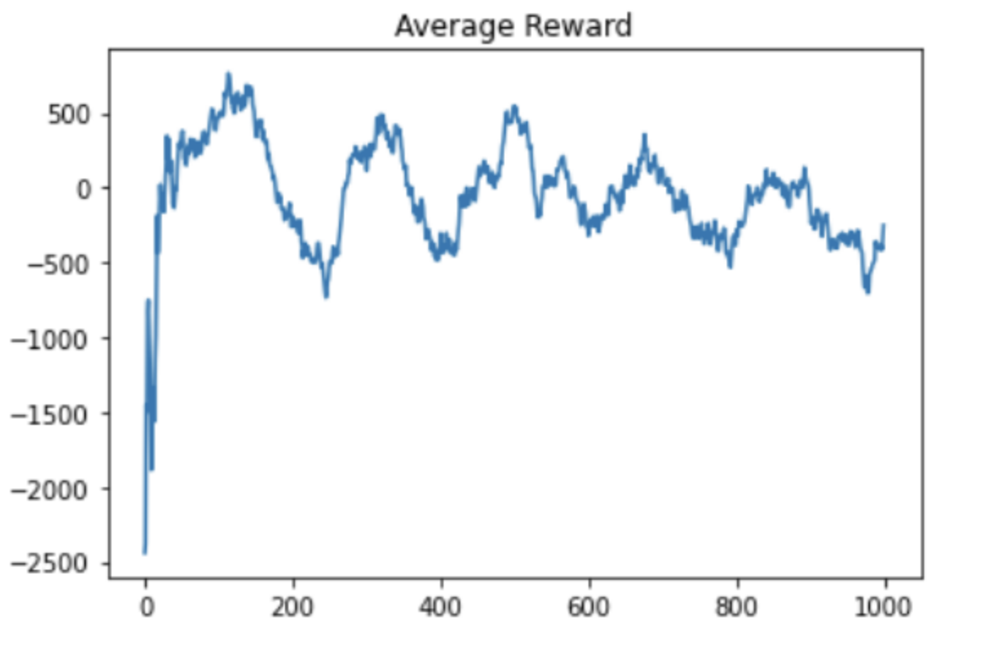

## Video

https://youtu.be/1w4e5qnMk1Y

## Project Summary

Contract Bridge is an imperfect information game which requires not just competition, but also cooperation. At present, there are no widely available Bridge playing software capable of beating expert human players. 

2 pairs of players first participate in an “auction” where they propose in turn (through “bids”) how many tricks they will win. Good bids require players to accurately gauge what cards their teammate holds and thus how many tricks they will win, given only the limited information of what bids their teammate has proposed.. After the auction is won, a “contract” is formed – the winning pair is trying to fulfill their bid, hence the term “contract”.
After the contract is created, 13 tricks are played and the number of tricks won by each pair are counted. Depending on the contract and the differences of tricks won vs. the contract, points are given out. This process is repeated until enough points have been won.
Our goal is to create an intelligent Bridge bidding agent. Bidding in Bridge is difficult for conventional algorithms such as minimax because the state space is large: for any given 13 card hand dealt to you, there are 10^16 different possible hands dealt to the 3 other players whose cards are hidden. Human players, however, can isolate the essential features of a hand: the number of face cards, total number of cards of each suit, etc, and quickly narrow down the possibilities. Therefore, we believe that deep learning is suited for the task of feature selection and extraction, and reinforcement learning is suited for the game-playing stage of the task.
We will be using DeepMind’s [OpenSpiel](https://github.com/deepmind/open_spiel) as a starter for the environment. Our agent should be able to output a bid based on previous bids and knowledge of its current hand.
At the moment, we intend to build an agent that functions as a single player (Bridge is played in teams of 2).

## Approaches

We test several RL algorithms to reach this goal: 
- Double Deep Q-Learning (DQN)
- Advantage Actor-Critic (A2C)

We noticed through DQN that the agent was performing very badly when running from the ground up. Therefore, we think that imitation learning pre-training was very helpful in starting with a better baseline, and we used this supervised pre-train in A2C with decent results. 

The agents we trained in our RL environments against random agents were: 
- A2C + imitation learning
- Double DQN
- Double DQN with replay memory

The agents we trained against themselves were: 
- Double DQN
- Double DQN vs 10 snapshots of previous versions of self (1 per 100 episodes with  epsilon greedy decaying behavior)

There were some miscellaneous ideas as well, such as: 
- Exploring different ways of expressing reward such as artificially rewarding doubles on extremely high bids
- Utilizing part of the model for teammate hand prediction with a dual loss function in the supervised portion
- Using teammate hand prediction as a reward function during the RL phase 
- Upper Confidence Bound: We saw that late in training, our agents tended to converge onto suboptimal strategies, even with decaying Epsilon Greedy exploration. 

## Evaluation

For qualitative evaluation, David will play against our Bridge AI and gauge its performance as a general player. We will also run through several games using the OpenSpiel API using random moves and look at the outputs to check if there are any heuristically interesting decisions.

For quantitative evaluation, we look at both the supervised and reinforcement learning models individually.

We evaluate the validation accuracy of the supervised learning models on the Wbridge5 datasets, which are plays made by a leading Bridge autonomous agent.

We then evaluate the A2C-trained model using both of the supervised learning models. We first look at the training and validation accuracy of the actor models, and then evaluate the performance of the whole model over 1000 random games according to the rewards that we defined.

Average reward for A2C, RFC (residual fully connected).

For the A2C agents, the reward graphs do not make any noticeable improvement in 1000 episodes; in fact, they seem highly random. This signifies that the agent is not able to consistently make good bids. The trailing average of rewards – which is computed over the last 10 episodes for each new episode – does not seem to fluctuate, suggesting that the random fluctuations in the reward per episode zero themselves out over time. In the A2C training setting, the model does not seem to have made any significant improvements.

However, when analyzing the supervised-learning trained model, the move accuracy for both the RFC and base networks reflect that the bidding conventions from the WBridge5 dataset have been incorporated into the model’s prior knowledge. The accuracies below, despite not meeting numerically satisfactory thresholds, are a significant improvement over the uniform random chance (~2%) to guess the correct bid.

Supervised training
- RFC: 27.35%
- Base: 47.47%

A2C training
- RFC: 29.44%
- Base: 52.23%

Qualitative play against the A2C agent reveals that the agent can occasionally make intelligent bids, such as doubling an extremely high bid or passing when their hand is weak. Given this information, we hypothesize that the A2C models are not flexible in their strategies against different types of players; this would explain the apparent lack of improvement in performance when the A2C agent plays against the random player.

The DQN agent plays in a tournament setting: each episode, one of the 10 most recent snapshots of the agent is chosen as the adversary. Thus, the average reward should naturally converge to 0. Inspecting the move distribution over several runs, we observed that the agent tended to fixate on a handful of (random) moves that it then played religiously. Except for passing, which it consistently learned was a good move (on average). The agent exhibits a high degree of overfitting and is very sensitive to its earliest experiences, which determine (via UCB) what actions it will explore. The Upper Confidence Bound algorithm is intended to force agents to explore all options, but also allow it to prioritize the best known options. In this case, it appears to shut out options with a few bad experiences, preventing the agent from learning how to use all the possible actions in concert.

## References

[Medium Article on A2C Implementation](https://medium.com/deeplearningmadeeasy/advantage-actor-critic-a2c-implementation-944e98616b): This is the A2C medium article that inspired our implementation.. 

[Medium Article on Double DQN](https://medium.com/@parsa_h_m/deep-reinforcement-learning-dqn-double-dqn-dueling-dqn-noisy-dqn-and-dqn-with-prioritized-551f621a9823): This is an article on Double DQN that explained many of the concepts that we implemented. 

[Official PyTorch DQN tutorial](https://pytorch.org/tutorials/intermediate/reinforcement_q_learning.html):  This is the official DQN tutorial that we heavily based our DQN training loop off of.   

[OpenSpiel](https://github.com/deepmind/open_spiel): This is a DeepMind collecion of environments of  various games.

[Upper Confidence Bound Algorithm](https://towardsdatascience.com/the-upper-confidence-bound-ucb-bandit-algorithm-c05c2bf4c13f) This is the algorithm we used over epsilon-greedy that was explained on Towards Data Science. 