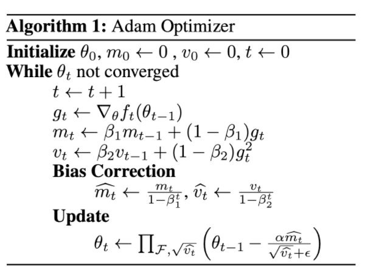
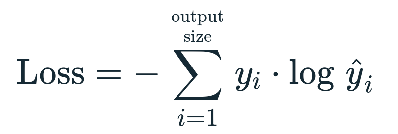
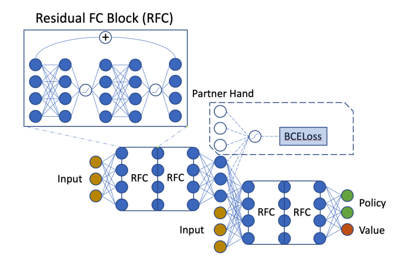
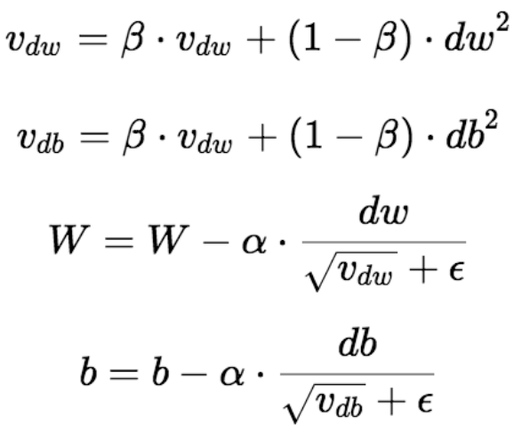
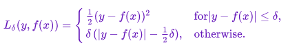
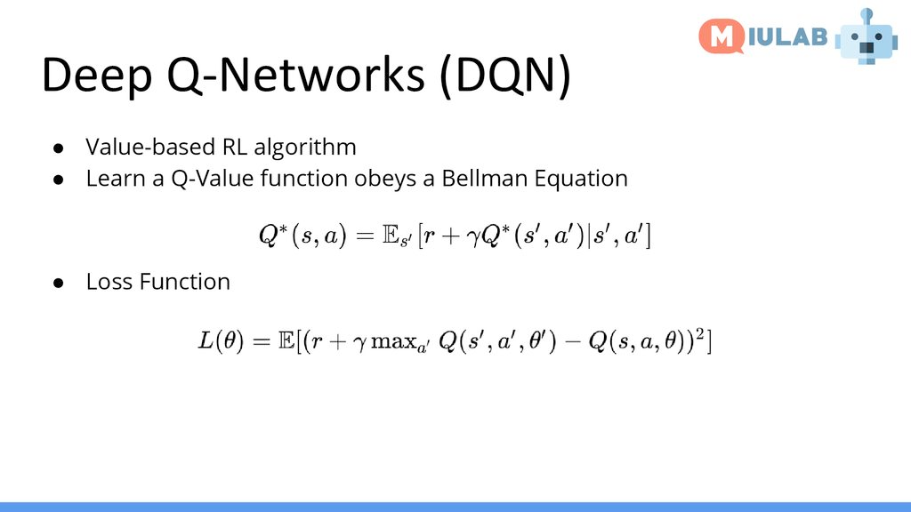
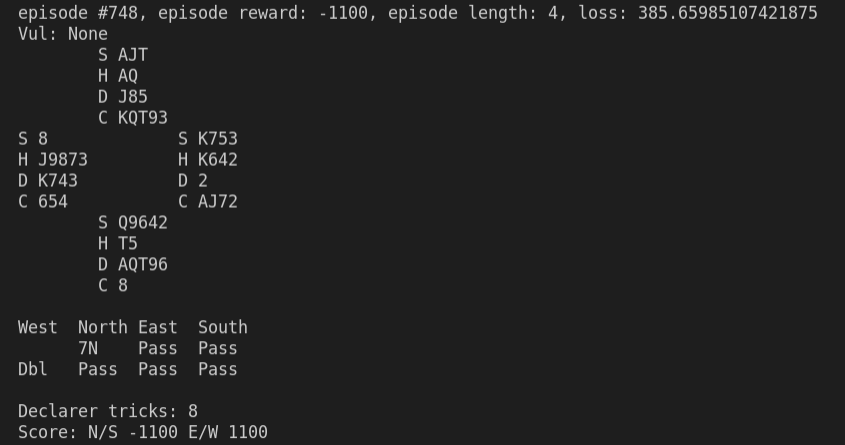
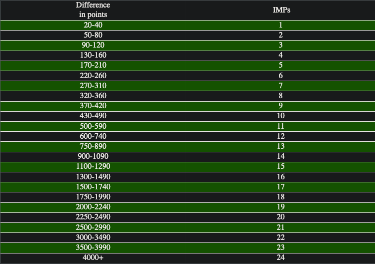

<iframe width="420" height="315" src="https://www.youtube.com/watch/njgHEeXTPj4" frameborder="0" allowfullscreen allowsameorigin></iframe>

## Project Summary: 

Our goal is to create an intelligent Bridge bidding agent. 
We will be using DeepMind's [OpenSpiel](https://github.com/deepmind/open_spiel) as the environment. 
Our agent should be able to output a bid based on previous bids and knowledge of its current hand. 
Currently, we have an agent that can function as a single player within the team of 2. 
This was initially trained with supervised learning imitating WBridge5 (another computer Bridge AI)
and later with a DQN. 

We hope to make our agent stronger and to perhaps use another method such as A3C or Joint Policy Search.
Depending on progress, we may attempt to incorporate human bidding conventions.

## Approach 
For the supervised learning portion, we used an Adam Optimizer with a learning rate of 
$10^{-4}$ and Cross Entropy Loss: 

The network we used to train is from the paper *Simple Is Better*: 

The dataset for this comes from open-spiel and is accessible online. This data consists of *trajectories*, 
which are possible game paths through the whole game tree; these trajectories are created by WBridge5 
which is a computer Bridge program that has won the World Computer Bridge Championship in 2018. 

Using this dataset is simply choosing a random index within that trajectory and training the agent to 
predict the next index of that same trajectory (using index).

For the reinforcement learning portion, we followed the training loop of a Deep Q-Network, or a DQN. The
model is the same model as we used previously, though we used RMSProp as our optimizer (due to sparse rewards)
and smooth L1 loss (Huber loss). 

The DQN algorithm consists of two Q-networks, or models, that have identical architecture (termed as *target*
and *policy* nets). The algorithm first predicts actions for a batch on the policy net, after which the state changes
and actions are predicted on the resultant state on the target net. The reward that the target state gets is then 
used to create a loss value and update the policy net. This equation is detailed below: 

The same Q-network plays as one of the pairs in the game but the observation tensor is still single-player. 
The opponents are simulated through random actions. The reward is computed using open_spiel's double dummy solver (DDS).

## Evaluation: 

Currently, the model does not perform too well through the eye test and printing the game state; the model seems to 
take a liking to bidding 7NT, which is almost always a terrible bid especially without any prior information. We can
see that North (the agent) has a very strong hand, but immediately jumps to 7NT and undertricks
by 5 and loses 1100 points (a very significant amount).  

For more objective evaluation, we plan on using IMPs/b, which is simply another way of quantifying the average point 
differential in Bridge game outcomes. These will be averaged over many runs to obtain actual strength, and we plan 
to use this against other established Bridge AI. 

## Remaining Goals and Challenges: 

The biggest challenge we have remaining is simply that our model does not perform too well. This may be caused
by bugs in our code or our very general encoding of the observation matrix, but this problem should be relatively
simple to fix. 

After our agent does reasonably well, we need to test it against other agents as well. We could also explore other
ineresting algorithms for training such as Asynchronous Advantage Actor-Critic (A3C) that may yield better results 
or converge faster than DQN does. 

## Resources Used: 

[Official PyTorch DQN tutorial](https://pytorch.org/tutorials/intermediate/reinforcement_q_learning.html): 
This is the official DQN tutorial that we heavily based our DQN training loop off of. 

[open_spiel](https://github.com/deepmind/open_spiel): This is a DeepMind collecion of environments of 
various games. 

[PyTorch Lightning](https://www.pytorchlightning.ai/): These docs were used for parallelizing across GPUs. 

[Simple Is Better](https://openreview.net/attachment?id=SklViCEFPH&name=original_pdf): A paper discussing methodology
of Bridge AI; we used the same network as they did.